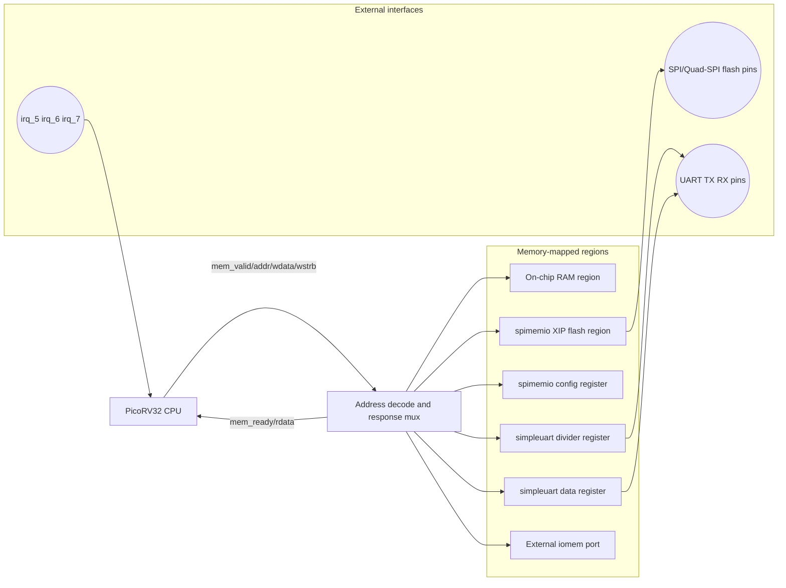

# PicoSoC Block Diagram

Reference design view for `design/rtl/cpu/picosoc/picosoc.v` (not the integrated SoC in `design/rtl/top/top_teste.v`).

## Notes

- Program reset address is `0x0010_0000`, so firmware is typically fetched from SPI flash via `spimemio`.
- Main map (quick view): `0x0000_0000..0x00FF_FFFF` SRAM window (with flash overlay beyond physical SRAM), `0x0100_0000..0x01FF_FFFF` SPI flash window, `0x0200_0000` config/UART registers, `0x0300_0000..0xFFFF_FFFF` external `iomem_*` peripherals.
- `iomem_*` lets board/top-level logic add peripherals outside the core SoC (for example, GPIO in `hx8kdemo.v` and `icebreaker.v`).
- The top wrappers (`hx8kdemo`/`icebreaker`) add reset generation, flash IO buffers, and board-specific LED wiring around this SoC.
