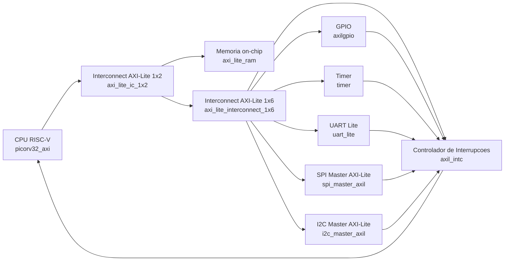
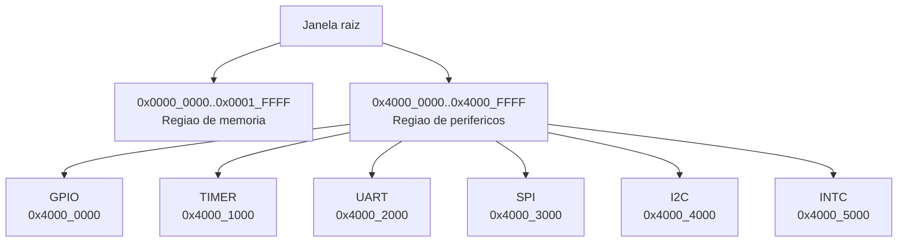

# SoC e Perifericos - Arquivos `.v` e Funcao de Cada Modulo

Documento adicional (sem alterar a documentacao existente) com foco no trabalho atual do SoC integrado em `design/rtl/top/top_teste.v`.

## Diagrama de integracao (visao funcional)

## Diagrama de janelas de endereco AXI-Lite

Fonte do mapa: `design/rtl/SoC_completo/soc_addr_map.vh`.

## Arquivos `.v` do SoC atual

| Arquivo `.v` | Modulo principal | Descricao funcional |
|---|---|---|
| `design/rtl/top/top_teste.v` | `soc_top_teste_mem_periph` | Top-level do SoC: instancia CPU, interconnects AXI-Lite, RAM e perifericos; agrega IRQs e conecta I/O externos (UART, SPI, I2C, GPIO). |
| `design/rtl/cpu/picorv32.v` | `picorv32`, `picorv32_axi`, etc. | Nucleo PicoRV32 e wrappers de barramento (inclui interface AXI-Lite usada como mestre pelo SoC). |
| `design/rtl/bus/axi_1_2.v` | `axi_lite_ic_1x2` | Decodificador/interconnect AXI-Lite 1 mestre para 2 escravos (separa regiao de memoria e perifericos). |
| `design/rtl/bus/axi_interconect_1_6.v` | `axi_lite_interconnect_1x6` | Interconnect AXI-Lite 1 para 6 perifericos com decode por base/mask e multiplexacao de respostas. |
| `design/rtl/bus/axi_mem.v` | `axi_lite_ram` | RAM mapeada em AXI-Lite com suporte a leitura/escrita por byte strobe e inicializacao opcional via arquivo HEX. |

## Arquivos `.v` dos perifericos (integrados no SoC atual)

| Arquivo `.v` | Modulo principal | Descricao funcional |
|---|---|---|
| `design/rtl/periph/gpio/axilgpio.v` | `axilgpio` | GPIO AXI-Lite com registradores de load/set/clear/toggle, leitura de entradas e geracao de interrupcao por mudanca de pino. |
| `design/rtl/periph/gpio/skidbuffer.v` | `skidbuffer` | Buffer de skid para handshake de canal AXI, usado para manter throughput e evitar perda em backpressure. |
| `design/rtl/periph/timer/timer.v` | `timer` | Timer AXI-Lite de 32 bits com compare, prescaler/postscaler, modo one-shot/autoreload e saida de interrupcao. |
| `design/rtl/periph/timer/timer_defs.v` | (defines) | Constantes de endereco/bitfields do timer usadas para decode de registradores e controle interno. |
| `design/rtl/SoC_completo/UART/uart_lite.v` | `uart_lite` | UART Lite AXI-Lite (TX/RX) com registradores de configuracao/status/dados e linha de interrupcao. |
| `design/rtl/SoC_completo/UART/uart_lite_defs.v` | (defines) | Definicoes de offsets e bits de controle/status da UART Lite. |
| `design/rtl/SoC_completo/SPI/spi_master_axil.v` | `spi_master_axil` | Wrapper AXI-Lite para controle de SPI master por registradores e FIFOs, expondo sinais de IRQ e interface SPI externa. |
| `design/rtl/SoC_completo/SPI/spi_master.v` | `spi_master` | Nucleo SPI master (geracao de clock, shift TX/RX, controle de CS e transferencia serial). |
| `design/rtl/SoC_completo/SPI/axis_fifo.v` | `axis_fifo` | FIFO AXI-Stream usada internamente no subsistema SPI para desacoplamento entre interface de registradores e datapath serial. |
| `design/rtl/SoC_completo/I2C/i2c_master_axil.v` | `i2c_master_axil` | Wrapper AXI-Lite do controlador I2C master com registradores, filas e controle de transacoes via software. |
| `design/rtl/SoC_completo/I2C/i2c_master.v` | `i2c_master` | Motor I2C master de baixo nivel (START/STOP, leitura/escrita de bytes, controle de SCL/SDA, estados de protocolo). |
| `design/rtl/SoC_completo/I2C/i2c_init.v` | `i2c_init` | Sequenciador de inicializacao/configuracao via I2C para execucao automatica de comandos no startup. |
| `design/rtl/SoC_completo/I2C/i2c_single_reg.v` | `i2c_single_reg` | Bloco de registrador AXI-Lite auxiliar para controle/estado no subsistema I2C. |
| `design/rtl/SoC_completo/I2C/axis_fifo.v` | `axis_fifo` | FIFO AXI-Stream usada no caminho de comandos/dados do controlador I2C. |
| `design/rtl/SoC_completo/INTC/axil_intc.v` | `axil_intc` | Controlador de interrupcoes AXI-Lite: mascara/pending por fonte e consolidacao para uma saida global para a CPU. |

## Observacoes para futura correcao da documentacao atual (sem alterar agora)

- `documentation/readme`: secao **Equipe** aparece duas vezes.
- `documentation/readme`: arvore de diretorios cita `rtl/` e `docs/`, enquanto o repositorio atual usa `design/rtl/` e `documentation/`.
- Possivel inconsistencia de alvo de FPGA entre partes da documentacao (DE1/Cyclone II vs referencias a iCE40 em documentacao do PicoSoC).
