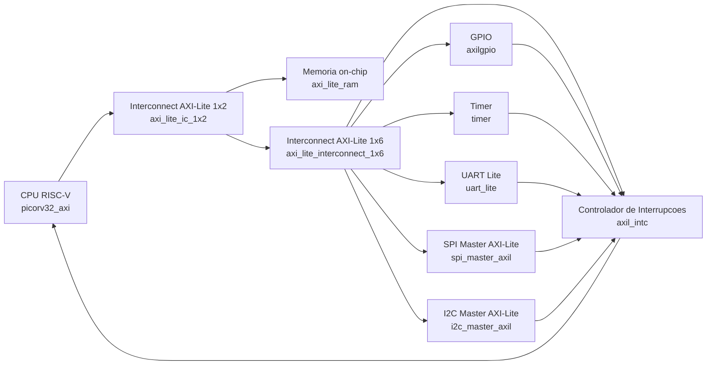
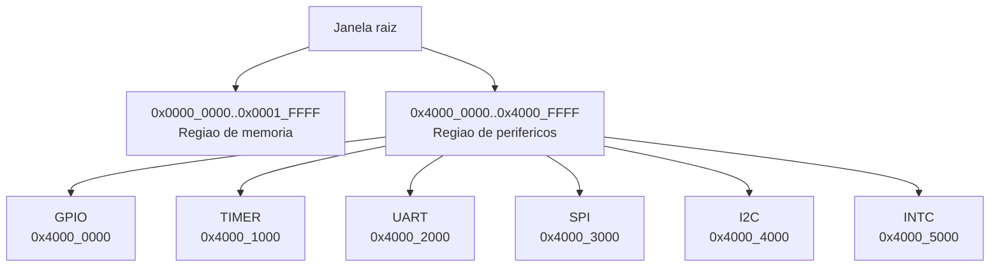

# SoC e Perifericos - Arquivos .v e Funcao de Cada Modulo

Documento adicional (sem alterar a documentacao existente) com foco no trabalho atual do SoC integrado em `top_teste.v`.

## Diagrama de integracao (visao funcional)

## Diagrama de janelas de endereco AXI-Lite

Fonte do mapa: `soc_addr_map.vh`.

## Arquivos .v do SoC atual

| Arquivo .v | Modulo principal | Descricao funcional |
|---|---|---|
| `top_teste.v` | `soc_top_teste_mem_periph` | Top-level do SoC: integra CPU, interconnects AXI-Lite, RAM, perifericos e IRQs. |
| `picorv32.v` | `picorv32`, `picorv32_axi`, etc. | Nucleo PicoRV32 e wrappers de barramento; inclui interface AXI-Lite usada como mestre. |
| `axi_1_2.v` | `axi_lite_ic_1x2` | Interconnect AXI-Lite 1x2 para separar memoria e perifericos. |
| `axi_interconect_1_6.v` | `axi_lite_interconnect_1x6` | Interconnect AXI-Lite 1x6 para decode de endereco e roteamento aos perifericos. |
| `axi_mem.v` | `axi_lite_ram` | RAM mapeada em AXI-Lite com leitura/escrita por byte strobe e preload opcional. |

## Arquivos .v dos perifericos (integrados no SoC atual)

| Arquivo .v | Modulo principal | Descricao funcional |
|---|---|---|
| `axilgpio.v` | `axilgpio` | GPIO AXI-Lite com registradores de load/set/clear/toggle e IRQ por mudanca de entrada. |
| `skidbuffer.v` (GPIO) | `skidbuffer` | Buffer de skid para handshake AXI sob backpressure. |
| `timer.v` | `timer` | Timer AXI-Lite com compare, prescaler/postscaler, one-shot/autoreload e IRQ. |
| `timer_defs.v` | `defines` | Constantes de endereco e bitfields do timer. |
| `uart_lite.v` | `uart_lite` | UART Lite AXI-Lite (TX/RX) com registradores de configuracao, status e dados. |
| `uart_lite_defs.v` | `defines` | Definicoes de offsets e bits de controle/status da UART Lite. |
| `spi_master_axil.v` | `spi_master_axil` | Wrapper AXI-Lite para controle do SPI master com registradores e FIFOs. |
| `spi_master.v` | `spi_master` | Nucleo SPI master (clock serial, shift TX/RX e controle de chip select). |
| `axis_fifo.v` (SPI) | `axis_fifo` | FIFO AXI-Stream usada no caminho de dados do SPI. |
| `i2c_master_axil.v` | `i2c_master_axil` | Wrapper AXI-Lite do I2C master com controle por software e filas. |
| `i2c_master.v` | `i2c_master` | Motor I2C master de protocolo (START/STOP, ACK/NACK, leitura/escrita). |
| `i2c_init.v` | `i2c_init` | Sequenciador de inicializacao I2C para startup. |
| `i2c_single_reg.v` | `i2c_single_reg` | Bloco de registrador de apoio para controle/estado do subsistema I2C. |
| `axis_fifo.v` (I2C) | `axis_fifo` | FIFO AXI-Stream usada no caminho de dados/comandos do I2C. |
| `axil_intc.v` | `axil_intc` | Controlador de interrupcoes AXI-Lite com mascara, pending e IRQ global para CPU. |

## Descricao funcional de cada modulo (module)

Escopo: modulos RTL usados no SoC atual (sem testbenches).

| Modulo | Arquivo .v | Funcao |
|---|---|---|
| `soc_top_teste_mem_periph` | `top_teste.v` | Integracao completa do SoC: CPU, memoria, interconnects, perifericos e roteamento de IRQs. |
| `picorv32` | `picorv32.v` | Core RISC-V RV32I principal (pipeline, decode/execute e acesso a memoria). |
| `picorv32_regs` | `picorv32.v` | Banco de registradores do PicoRV32 (x0..x31). |
| `picorv32_pcpi_mul` | `picorv32.v` | Coprocessador PCPI de multiplicacao iterativa. |
| `picorv32_pcpi_fast_mul` | `picorv32.v` | Coprocessador PCPI de multiplicacao com caminho mais rapido. |
| `picorv32_pcpi_div` | `picorv32.v` | Coprocessador PCPI para divisao/modulo. |
| `picorv32_axi` | `picorv32.v` | Wrapper do core com interface AXI mestre. |
| `picorv32_axi_adapter` | `picorv32.v` | Adaptador entre interface nativa de memoria e canal AXI. |
| `picorv32_wb` | `picorv32.v` | Wrapper alternativo para barramento Wishbone (nao usado no top atual). |
| `axi_lite_ic_1x2` | `axi_1_2.v` | Interconnect AXI-Lite 1x2 para separar trafego de memoria e perifericos. |
| `axi_lite_interconnect_1x6` | `axi_interconect_1_6.v` | Interconnect AXI-Lite 1x6 para decode e roteamento para 6 perifericos. |
| `axi_lite_ram` | `axi_mem.v` | Memoria RAM mapeada em AXI-Lite com leitura/escrita por bytes. |
| `axilgpio` | `axilgpio.v` | Periferico GPIO AXI-Lite com controle de saida, leitura de entrada e IRQ. |
| `skidbuffer` | `skidbuffer.v` (GPIO) | Buffer de skid para estabilidade de handshake AXI. |
| `timer` | `timer.v` | Timer com compare, prescaler/postscaler, autoreload e interrupcao. |
| `uart_lite` | `uart_lite.v` | UART Lite com configuracao AXI-Lite, TX/RX e status/IRQ. |
| `spi_master_axil` | `spi_master_axil.v` | Interface AXI-Lite de alto nivel para comandar o SPI master. |
| `spi_master` | `spi_master.v` | Motor SPI de baixo nivel para transferencia serial e controle de CS. |
| `axis_fifo` | `axis_fifo.v` (SPI) | FIFO AXI-Stream do caminho de dados do SPI. |
| `i2c_master_axil` | `i2c_master_axil.v` | Interface AXI-Lite para controle do I2C master e filas de comando. |
| `i2c_master` | `i2c_master.v` | Motor I2C master com controle de protocolo e temporizacao de SCL/SDA. |
| `i2c_init` | `i2c_init.v` | Modulo de inicializacao automatica de sequencias I2C na partida. |
| `i2c_single_reg` | `i2c_single_reg.v` | Bloco de registrador de apoio para configuracao/status do I2C. |
| `axis_fifo` | `axis_fifo.v` (I2C) | FIFO AXI-Stream no caminho de dados/comandos do I2C. |
| `axil_intc` | `axil_intc.v` | Controlador de interrupcoes AXI-Lite com mascara, pending e consolidacao em IRQ global. |
